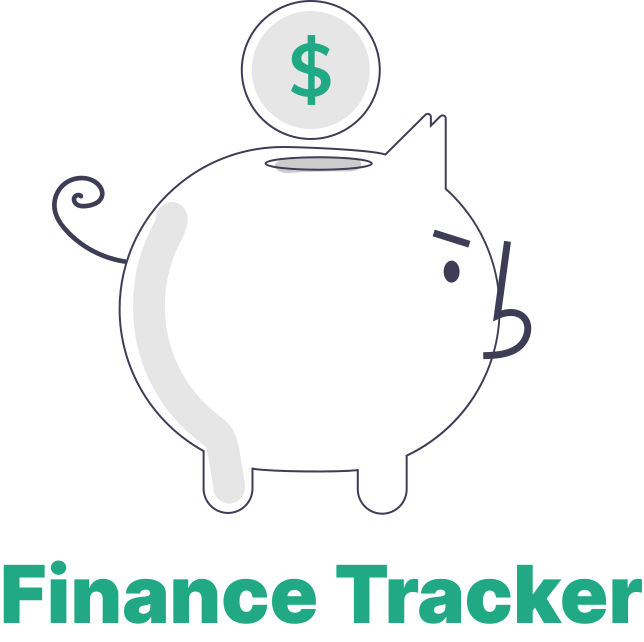
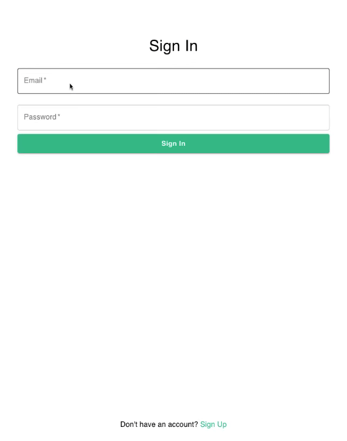

 

<a href="https://hyeonahc-finance-tracker.vercel.app/" target="_blank">

 

# Finance Tracker

## 📑 Table of Contents

- [🚀 Quick Start](#-quick-start)
- [🗓 Project Duration](#-project-duration)
- [✨ Project Summary](#-project-summary)
- [👀 Demo](#demo)
- [🪄 Tech Stack & Tools](#-tech-stack--tools)
  - [Front-End Tech Stack](#front-end-tech-stack)
  - [Back-End Tech Stack](#back-end-tech-stack)
- [⚙️ Key Features and Logic](#%EF%B8%8Fkey-features-and-logic)

 

## 🚀 Quick Start

1. Clone this repo: `git clone https://github.com/hyeonahc/finance-tracker.git`
2. Move to the project directory `cd finance-tracker`.
3. Install dependencies: `pnpm install`
4. Start the project
   - Development mode: `pnpm run dev`
   - After build: `pnpm build` then `pnpm start`
5. To run the project, you may need environment variables. Please contact [hyeonah.hello@gmail.com](hyeonah.hello@gmail.com) for details.

 

## 🗓 Project Duration

Jul 9, 2024 - Present

### **Timeline**

- [Version 0.1.0 released: Mar 2, 2025](https://github.com/hyeonahc/finance-tracker/releases/tag/v0.1.0)

 

## ✨ Project Summary

Finance Tracker helps users track income and expenses. It offers multiple viewing options, filters by date, and provides a clear financial summary. Future updates will include budgeting, goal tracking, and visual insights for better financial management.

### Key Features Version 0.1.0

- **Sign Up & Sign In**: Securely create an account and log in to access your financial data.
- **Add Transactions**: Manually log income and expenses with key details (title, date, amount and category).
- **Income, Expense, and Total Summary**: Get an overview of your financial status at a glance.
- **Top Filter by Month/Year**: Easily switch between different timeframes.
- **Transaction Views**: View financial data in four formats\*\*:
  - **Daily**: List of transactions per day.
  - **Monthly**: Aggregated view of monthly transactions.
  - **Calendar**: Interactive calendar for quick insights.
  - **Category**: Breakdown of expenses by category.

This is just the beginning! Try it out and stay tuned for more updates! 💰📊

## 👀 Demo

### Live Website

🔗 [Visit the live website on Vercel](https://hyeonahc-finance-tracker.vercel.app)

### Short Video Demo

| Sign up                                 | Sign in                                 |
| --------------------------------------- | --------------------------------------- |
|  |  |

 

| Transactions on Different Views       | Add Transaction                                           |
| ------------------------------------- | --------------------------------------------------------- |
|  |  |

 

## 🪄 Tech Stack

### Front-End Tech Stack

- **Framework**: React
- **Programming Language**: TypeScript
- **Router**: React Router
- **State Management**: Zustand
- **API Request**: React Query
- **Design**: MUI, Emotion

### Back-End Tech Stack

- **Runtime Environment**: Node.js
- **Framework**: Express
- **Programming Language**: TypeScript
- **Database**: MongoDB
- **Authentication**: JSON Web Token (JWT)
- **Security**: bcrypt, validator
- **Environment Management**: dotenv
